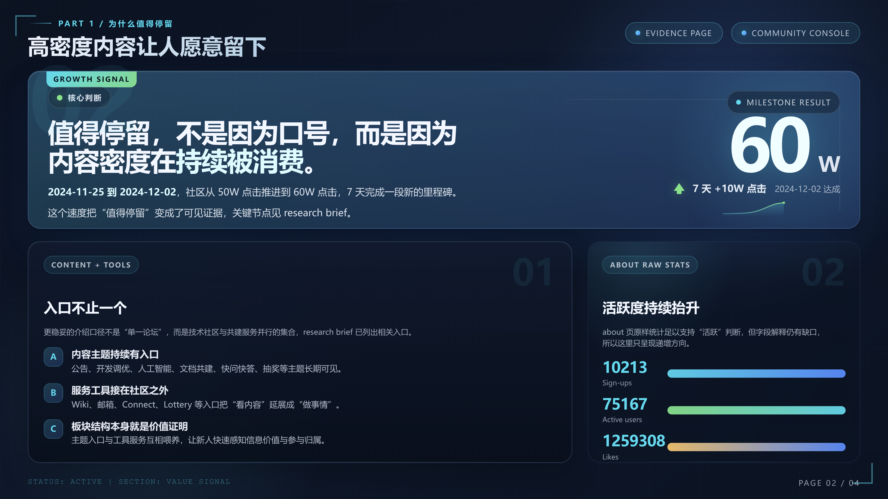

<div align="center">
  
  <h1>PPT Agent</h1>
  <p>基于软件工程理念的演示文稿全自动生成框架</p>
  <p><a href="README_EN.md">English</a> | 中文</p>

  <p>
    <a href="#快速开始"></a>
    <a href="LICENSE"></a>
  </p>

  <p>
    
    
    
    
    
    
  </p>
</div>

---

**PPT Agent** 以严格的状态机驱动多 Agent 协作，将一句话需求输出为专业级 PPTX 文件，从根源解决传统大模型生成的幻觉、重叠与布局混乱问题。

## 安装

```
npx skills add sunbigfly/ppt-agent-skills
```


## 核心亮点

**Subagent 阶段隔离**：Research / Outline / Style / Planning 四大阶段各自运行独立的子代理，Context 不互染。每个子代理创建时强制携带 `SUBAGENT_MODEL` 参数，禁止走默认回退。

**像素级 Visual QA 闭环**：每页 HTML 构建后自动截图，由大模型进行视觉审计。检测到布局溢出后，子代理以 DOM + CSS 结构重写的方式消除冲突，而非依赖间距微调。

**无状态断点恢复**：全流程不依赖任何进度状态文件。中断后通过扫描磁盘上已存在的产物文件（`outline.txt` / `style.json` / `slide-N.png` 等）自动推断恢复点。

**数据层与渲染层隔离**：每页先生成并由 `planning_validator.py` 通过校验的 JSON 合同，再驱动 HTML 渲染。写入前校验拦截所有结构错误，不进入渲染流程。

**双引擎 PPTX 导出**：PNG 光栅流保证跨平台 100% 视觉还原；SVG 矢量流保留字体可独立编辑。

## 工作流

```
P0 采访   →  P1 分支确认
P2A 联网检索 / P2B 本地资料压缩
P3 叙事大纲  →  P3.5 全局风格锁定
P4 逐页并行生产（Planning → HTML → Visual QA）
P5 Preview + 双 PPTX 导出
```

每个阶段产物落盘后经 Gate 校验放行，失败只回退当前步，不影响其他页进度。

## 产物链

```
interview-qa.txt → requirements-interview.txt
  → search-brief.txt | source-brief.txt
  → outline.txt → style.json
  → planningN.json → slide-N.html → slide-N.png
  → preview.html → presentation-{png,svg}.pptx
```

## 效果示例

<details>
  <summary>点击展开渲染参照</summary>
  <div align="center">
    <br/>
    
    
    
    
  </div>
</details>

## 快速开始

本项目以 Agent Skill 形式运行，无需独立部署。在支持 Skill 的代理环境中直接输入需求即可触发完整流程：

> *"帮我生成一份关于 2026 年具身智能发展趋势的 15 页路演 Deck，暗色科技风格。"*

所有产物输出至 `ppt-output/runs/<RUN_ID>/`，包含网页预览和双格式 PPTX。

## 仓库结构

```
ppt-agent-skill/
├── SKILL.md          # 主控制台：状态机、Gate、恢复规则
├── scripts/          # 执行脚本（validator / harness / exporter）
├── references/       # 按需挂载的 Markdown 知识源
│   ├── playbooks/    # 各阶段子代理执行手册
│   ├── styles/       # 主题风格规范
│   ├── layouts/      # 版式资源
│   ├── charts/       # 图表模板
│   └── blocks/       # UI 组件
└── assets/
```

## 友情链接

已链接认可 [LINUX DO 社区](https://linux.do) 的友情链接。

## License

[MIT](LICENSE)
